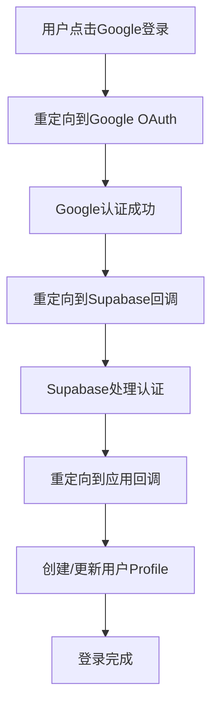

# 面试助手 - 技术架构文档

## 🏗️ 系统架构概览

### 技术栈
- **前端：** Next.js 14 + TypeScript + Tailwind CSS
- **状态管理：** Zustand
- **认证：** Supabase Auth (Google OAuth)
- **数据库：** Supabase PostgreSQL
- **音频处理：** Web Audio API + MediaRecorder
- **AI服务：** OpenAI Whisper + GPT-4

### 部署环境
- **开发：** localhost:3000
- **生产：** Vercel (https://interview.cnbu.link)

## 📁 项目结构

```
src/
├── app/                    # Next.js App Router
├── components/             # React组件
├── contexts/              # React上下文
├── hooks/                 # 自定义Hooks
├── lib/                   # 第三方库配置
├── services/              # 业务逻辑层
│   ├── streaming/         # 音频流处理
│   ├── interview-summary/ # AI分析服务
│   ├── storage/          # 数据存储抽象层
│   └── interfaces.ts     # 服务接口定义
├── store/                # Zustand状态管理
├── types/                # TypeScript类型定义
└── utils/                # 工具函数
```

## 🔧 核心服务架构

### 音频处理层
```typescript
// 音频流处理服务
enhanced-wav-streaming-transcription.ts  // 多音源音频处理
wav-streaming-transcription.ts           // 基础WAV流处理
whisper-audio.ts                        // Whisper API集成
```

### AI分析层
```typescript
// AI分析服务
gpt4-summary-service.ts           // GPT-4面试总结
summary-generation-manager.ts    // 异步任务管理
text-chunking.ts                 // 大文本分段处理
```

### 数据存储层（重构前）
```typescript
// 单一大文件（问题）
supabase-storage.ts  // 966行，违反架构原则
```

### 数据存储层（重构后 - 目标架构）
```typescript
storage/
├── user-profile.service.ts      // 用户资料管理 (~150行)
├── interview-session.service.ts // 面试会话管理 (~200行)
├── position-template.service.ts // 岗位模板管理 (~100行)
├── settings.service.ts          // 用户设置管理 (~50行)
└── index.ts                     // 统一导出接口
```

## 🔄 架构演进记录

### v1.0 单体架构
- 所有功能集中在单个服务类
- 本地存储为主（IndexedDB）
- 简单的状态管理

### v2.0 云端集成
- 引入Supabase认证和数据库
- OAuth社交登录
- 数据云端同步

### v2.1 架构重构（当前）
**问题识别：**
- `supabase-storage.ts`文件过长（966行）
- 职责混乱，违反单一职责原则
- 临时禁用功能的方式不优雅

**重构目标：**
- 按功能拆分服务类
- 每个文件控制在500行以内
- 使用适配器模式处理功能降级
- 优化认证流程

### v3.0 微服务化（规划）
- 独立的AI分析服务
- 音频处理服务分离
- API网关统一管理

## 🔐 认证流程



## 🗃️ 数据库设计

### 核心表结构
```sql
-- 用户资料表
user_profiles (
  id, user_id, display_name, avatar_url, 
  settings, created_at, updated_at
)

-- 面试会话表  
interview_sessions (
  id, user_id, candidate_name, position,
  status, created_at, updated_at
)

-- 转录片段表
transcription_segments (
  id, session_id, original_text, translated_text,
  start_time, end_time, created_at
)

-- 岗位模板表（暂时禁用）
position_templates (
  id, user_id, name, description,
  requirements, evaluation_criteria
)
```

## ⚡ 性能优化策略

### 音频处理
- WAV格式优化Whisper API兼容性
- 实时音频质量监控
- 多音源混合处理

### AI处理
- 语义分段减少token消耗
- 异步任务管理
- 进度追踪和错误恢复

### 存储优化
- 数据压缩和增量同步
- 本地缓存策略
- RLS行级安全

## 🚨 已知问题和技术债务

1. **position_templates表依赖问题**
   - 触发器函数执行失败
   - 临时禁用影响功能完整性

2. **服务层架构问题**
   - 单文件过长违反规范
   - 职责不清晰

3. **错误处理不统一**
   - 各服务错误处理方式不一致
   - 缺乏统一的错误处理中间件

## 🎯 重构计划

### 阶段1：服务拆分（进行中）
- ✅ 创建架构文档
- 🔄 拆分存储服务
- 🔄 重构认证逻辑
- 🔄 更新类型定义

### 阶段2：功能恢复
- 🔄 修复position_templates功能
- 🔄 实现优雅降级
- 🔄 添加功能开关

### 阶段3：优化完善
- 🔄 统一错误处理
- 🔄 性能监控
- 🔄 单元测试覆盖